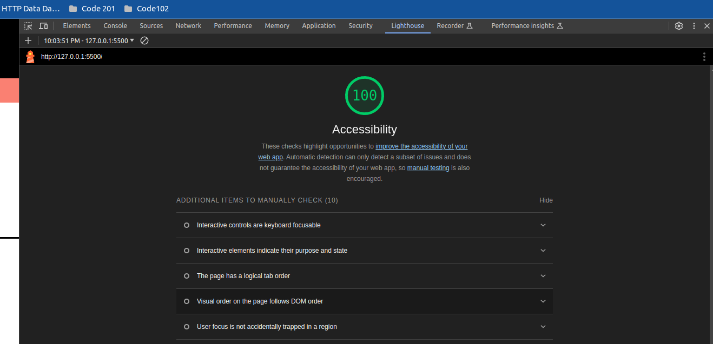

# Cookie Sales Report

## Table of Contents

- [Description](#description)
- [Features](#features)
- [License](#license)
- [Lighthouse](#lighthouse)

## Description

The Cookie Sales Report is a JavaScript-based project that simulates the daily sales of a chain of cookie stores in different locations.
It generates hourly sales reports and displays the total cookies sold for each store.

## Features

- Creates hourly sales reports for multiple store locations.
- Calculates the total cookies sold for each store.
- Displays sales data in a structured format.

## License

This project is licensed under the MIT License - see the LICENSE file for details.

## Lighthouse

